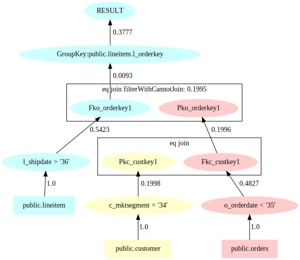

# Mirage

Mirage is a query-aware database generator. Mirage aims to generate a synthetic data processing environment to simulate the real-world application with specific  data and workload characteristics.

## Citation
Please cite our papers, if you find this work useful or use it in your paper as a baseline.
```
@inproceedings{wang2024mirage,
  title={Mirage: Generating Enormous Databases for Complex Workloads},
  author={Wang, Qingshuai and Li, Hao and Hu, Zirui and Zhang, Rong and Yang, Chengcheng and Cai, Peng and Zhou, Xuan and Zhou, Aoying},
  booktitle={2024 IEEE 40th International Conference on Data Engineering (ICDE)},
  pages={3989--4001},
  year={2024},
  organization={IEEE}
}
```

## Manual
Mirage supports all the versions from PostgreSQL 12 to PostgreSQL 15. Mirage's workflow is divided into four steps: query analysis; parameter instantiation; data generation; and schema generation, which can be executed directly using the given command line.


### Query Analysis
The main work of query parsing is to parse the table column information of the database, execute the original query to get the query plan, extract the query template, and get the constraint chain information. All the results are stored in the parsing result storage directory set in the configuration file.

Before using, please add the version of Mirage to the environment variable with the following command.
```bash
export version=0.1.0
```
> **Accurate Identification of IndexScan Cardinality** Since the query plan of Postgresql, the rows of indexScan (i.e. the column of indexScan operator) are shown as the total number of rows entered row divided by the number of loops, which will be rounded if the result is a floating point number.
> As shown below, the first row is the information about the number of rows in the original pg query plan after the execution of indexScan, and the second row is the information about the correct number of rows.
```diff
- Index Scan using lineitem_orderkey on lineitem (actual rows=0 loops=157474)
+ Index Scan using lineitem_orderkey on lineitem (actual rows=0.4174 loops=157474)
```
Therefore, before parsing the query, you need to modify the source code of Postgresql to explain to make it display more accurate information about the number of rows. Take pg15 as an example, you only need to modify the file postgres-REL_15_1/src/backend/commands/explain.c (the modification method is common to all versions), and the modification method is as follows:
```diff
--- tmp_postgres-REL_15/postgres-REL_15_1/src/backend/commands/explain.c 2022-11-08 05:36:53.000000000 +0800
+++ postgres-REL_15_1/src/backend/commands/explain.c 2022-11-25 10:43:37.378649399 +0800
@@ -1625,11 +1625,11 @@ ExplainNode(PlanState *planstate, List *
   {
    if (es->timing)
     appendStringInfo(es->str,
-         " (actual time=%.3f..%.3f rows=%.0f loops=%.0f)",
+         " (actual time=%.3f..%.3f rows=%.4f loops=%.0f)",
          startup_ms, total_ms, rows, nloops);
    else
     appendStringInfo(es->str,
-         " (actual rows=%.0f loops=%.0f)",
+         " (actual rows=%.4f loops=%.0f)",
          rows, nloops);
   }
   else
@@ -1641,7 +1641,7 @@ ExplainNode(PlanState *planstate, List *
     ExplainPropertyFloat("Actual Total Time", "ms", total_ms,
           3, es);
    }
-   ExplainPropertyFloat("Actual Rows", NULL, rows, 0, es);
+   ExplainPropertyFloat("Actual Rows", NULL, rows, 4, es);
    ExplainPropertyFloat("Actual Loops", NULL, nloops, 0, es);
   }
  }
@@ -1691,11 +1691,11 @@ ExplainNode(PlanState *planstate, List *
     ExplainIndentText(es);
     if (es->timing)
      appendStringInfo(es->str,
-          "actual time=%.3f..%.3f rows=%.0f loops=%.0f\n",
+          "actual time=%.3f..%.3f rows=%.4f loops=%.0f\n",
           startup_ms, total_ms, rows, nloops);
     else
      appendStringInfo(es->str,
-          "actual rows=%.0f loops=%.0f\n",
+          "actual rows=%.4f loops=%.0f\n",
           rows, nloops);
    }
    else
@@ -1707,7 +1707,7 @@ ExplainNode(PlanState *planstate, List *
      ExplainPropertyFloat("Actual Total Time", "ms",
            total_ms, 3, es);
     }
-    ExplainPropertyFloat("Actual Rows", NULL, rows, 0, es);
+    ExplainPropertyFloat("Actual Rows", NULL, rows, 4, es);
     ExplainPropertyFloat("Actual Loops", NULL, nloops, 0, es);
    }
 
@@ -3422,7 +3422,7 @@ show_instrumentation_count(const char *q
  if (nfiltered > 0 || es->format != EXPLAIN_FORMAT_TEXT)
  {
   if (nloops > 0)
-   ExplainPropertyFloat(qlabel, NULL, nfiltered / nloops, 0, es);
+   ExplainPropertyFloat(qlabel, NULL, nfiltered / nloops, 4, es);
   else
    ExplainPropertyFloat(qlabel, NULL, 0.0, 0, es);
  }
```
After the modification is completed, the query can be parsed, and the template of the command line for query parsing is

```bash
java -jar Mirage-${version}.jar prepare -c config.json -t db_type -l
```

Where `-c` is entered as the configuration file, `-t` is the type of database (currently, POSTGRESQL and GAUSS are supported in the query parsing phase), and `-l` determines whether to reuse the Schema information.
> **Reuse Schema Information:** Since Mirage uses a parsing algorithm that parses the topological relationships of all table primary and foreign key dependencies, the parsing process can be time-consuming. The -l parameter mentioned earlier is to allow parsing of table column information to skip this step in the case of files with table column information so that the program does not do duplicate work.

Specifically, the configuration file config.json is formatted to contain information such as database connection information and directory information.
1. `databaseConnectorConfig`: Database connection information. It is the connection configuration information for connecting to the target database.
2. `queriesDirectory`: The directory where the query is located refers to the query ready for simulation.
3. `resultDirectory`: The execution result storage directory refers to the directory where the parsed database information is stored.
4. `defaultSchemaName`: The default schema name of the database, this is due to the characteristics of Postgresql, you must specify the schema that belongs to, here fill in the default public is good.

An example is shown below.
```json lines
{
  "databaseConnectorConfig": {
    "databaseIp": "127.0.0.1", //database IP
    "databaseName": "tpch1", //database name
    "databasePort": "5432", //database port
    "databasePwd": "mima123", //database password
    "databaseUser": "postgres" //database username
  },
  "queriesDirectory": "conf/sql", //directory where the query is located
  "resultDirectory": "result", //execution result storage directory
  "defaultSchemaName": "public" //database default schema name
}
```
If you do not want to use the method of setting the configuration file, you can also set the configuration information directly by using the command line method, the specific parameters are shown below:
```shell
-D, --database_name=<databaseName> database name
-H, --host=<databaseIp> database ip, default value: 'localhost'
-o, --output=<resultDirectory> the dir path for output
-p, --password database password
-P, --port=<databasePort> database port, default value: '4000'
-q, --query_input=<queriesDirectory> the dir path of queries
-u, --user=<databaseUser> database user name
```

Once you fill in the configuration information, you can execute the query parsing.


### Parameter Instantiation
The parameter instantiation phase focuses on the instantiation of anonymized parameters in the command line format of
```bash
java -jar Mirage-${version}.jar instantiate -c result
```
Where only the parameter -c, the output directory of the query parsing phase (resultDirectory of the previous phase), is required. After execution, the output directory will have two additional folders, the distribution folder and the queries folder (see Collecting information content).
The queries folder contains the individual queries after parameter instantiation, that is, the generated simulation queries, a process called query rewriting.

### Data Generation
The data generation phase mainly generates data for each table, which uses all the CPU resources of the machine to generate, and the generation speed is linearly related to the number of CPUs. The recommended memory is at least 16 GB, and the command line format is
```bash
java -jar Mirage-${version}.jar generate -c result -o data
```
where -c refers to the directory of the output results of parsing and instantiation mentioned earlier, and -o refers to the location of the generated data file.

### Schema Generation
To facilitate verification of the correctness of the generated simulation query and simulation database, we also designed the create command to generate the table build statement, the command line command is
```bash
java -jar Mirage-${version}.jar create -c result -d demo -o createSql
```
Where -c refers to the directory for parsing and instantiating the generated results, -d refers to the name of the generated simulation database, and -o refers to the directory for generating the table building statements.
Note: The path to the data file in importData.sql needs to be filled in by the user.

After generating the database, it is ready for validation.

## Content of The Information Collected
As mentioned above, the collection information obtained by Query parsing is placed in the `resultDirectory` folder set in the query parsing stage. Take the 7th query of TPC-H as an example, the structure of the parsed file is as follows
```
.
├── column.csv
├── column2IdList
├── queries
│   └── 3_1.sql
├── schema.json
└── workload
    └── 3_1
        ├── 3_1.sql.dot
        ├── 3_1.sql.json
        └── 3_1Template.sql
```
The significance of each of these documents is described below

### schema.json
The file is the database table information obtained by parsing, and the following is an example to illustrate its structure.


```json
{
  "public.lineitem": {
    "tableSize": 6001215,
    "primaryKeys": "public.lineitem.l_linenumber",
    "canonicalColumnNames": [
      "public.lineitem.l_orderkey",
      "public.lineitem.l_partkey",
      "public.lineitem.l_suppkey",
      "public.lineitem.l_linenumber",
      "public.lineitem.l_quantity",
      "public.lineitem.l_extendedprice",
      "public.lineitem.l_discount",
      "public.lineitem.l_tax"
    ],
    "foreignKeys": {
      "public.lineitem.l_orderkey": "public.orders.o_orderkey",
      "public.lineitem.l_partkey": "public.part.p_partkey",
      "public.lineitem.l_suppkey": "public.supplier.s_suppkey"
    }
  }
}
```

As shown in the example above, schema.json mainly holds the table name, table size primary key information, foreign key information (foreign key and dependent primary key), and attribute column information for each table involved in the query.
### column.csv
The file contains the parsed column information, which is `columnName`, `columnType`, `nullPercentage`.

`specialValue` (indicating the range of value fields), `min` (minimum value), `range` (range), `originalType` (the original data type obtained directly from the database).

`avgLength` (average length of a string type column), `maxLength` (maximum length of a string type column).

### column2IdList
The file is the columns associated with the equivalence unary cardinality constraint and their corresponding parameter IDs, and since Mirage needs to anonymize the parameters of the original query, a unique parameter ID is attached to each parameter. Unary cardinality constraints are of form A·Pk, where A refers to the column name, Pk refers to the symbolized parameter, and · refers to the symbol, including =, ≠, <, >, ≤, ≥, (NOT ) IN, (NOT) LIKE. the main purpose of this file is to perform probabilistic reuse during parameter instantiation.
### Workload Dictionary
This file contains the query plan, query template, and constraint chain information for each query. As shown in the directory structure above
where the dot file is the query plan for that query, presented in graphviz format, taking the third query of TPC-H as an example.



The image is ".dot" file, viewing the image may require the help of graphviz's rendering plugin. You can see that this is the tree structure of the query execution, where there are leaf nodes representing the relationship table, selection nodes, and join nodes.

In the Json file is the constraint chain information obtained by parsing the query.

The Template.sql file is the extracted query template, i.e. the original query after anonymizing the parameters.

## Common Exceptions and How to Handle Them

### Conflict Real Parameter Substitution
In general, most of the parameter instantiation can be done automatically by Mirage, but due to the complexity of parameter substitution, this part is not fully functional, so some parameters need to be filled in manually. The log for performing parameter instantiation will show which parameter substitutions have failed, in the format shown in the following example:

The parameters that were not successfully replaced are as follows`[{id:37, data:1.00}, {id:95, data:interval '-340' day}, {id:100, data:-1000.00}, {id:109, data:-1000.00}, {id:129, data:0.12}, {id:133, data:4u9gf47}, {id:134, data:-xjfrez}, {id:135, data:5j98fqm}, {id:136, data:-xjfrez}]`

The information that needs to be filled in manually is usually presented as a comment in the first line of the sql file in the queries folder. The format is shown in the following example:

```sql
-- cannotFindArgs:{id:129,data:'0.04',operand:public.lineitem.l_discount}
select sum(l_extendedprice * l_discount) as revenue
from lineitem
where l_shipdate >= date '1998-10-14'
  and l_shipdate < date '1998-12-04'
  and l_discount between '0.00' and 0.03 + 0.01
  and l_quantity < '50.03';
```

The first line in the example will show the parameter ids that are not filled successfully and the original parameter value, find the parameter value with the same parameter id in the log information, and replace it. In this example, the data in the first line is 0.04, which is 0.03+0.01 in the query, find the data with id 129 in the log is 0.12, then replace 0.03+0.01 with 0.12.<br>

### Conflicting Virtual Parameter Replacement
In addition to the above real "parameters" (i.e., parameters that exist in the original query), there are also some virtual parameters that need to be filled in manually. Virtual parameters are parameters that do not actually exist in the original query but are generated by the Mirage algorithm to simulate the query. For example, in the 21st query of TPCH, there is a where condition `l1.l_receiptdate > l1.l_commitdate`, which Mirage converts to `l1.l_receiptdate - l1.l_commitdate > Parameter`, where the Parameter is the virtual parameter. And {id:95, data:interval '-340'day} in the log is the value that this virtual parameter should fill, so here it should fill `l1.l_receiptdate > l1.l_commitdate - 340 day`. Another case of a virtual parameter is when the query plan is two query trees, the output result of one query will become the parameter used in the other query plan, then this output result will become a virtual parameter, for example, the 22nd query of TPCH. The query plan result of the inner loop is used as the query condition parameter of the outer loop. From the first line of 22_1.sql in the queries folder, you can see `cannotFindArgs:{id:109,data:'$0',operand:public.customer.c_acctbal},{id:100,data:'0.0',operand.
public.customer.c_acctbal}`. Here `$0` is the virtual parameter, and the corresponding parameter found in the log should be filled as `-1000`. The result of the inner query can be seen in the 22nd query of TPCH as the parameter of the outer loop. This is shown below

```sql
and c_acctbal > (select avg(c_acctbal)
                            from customer
                            where c_acctbal > 0.00
                              and substring(c_phone from 1 for 2) in
                                  ('11', '13', '12', '28', '19', '20', '24'))
```

The fill method here is actually constructing c_acctbal > -1000, that is, running an internal query to get the result, and then using addition or multiplication to change the number to the right of the outer greater than sign to -1000.

## Arithmetic Supported
### Join
Mirage can only handle PK-FK joins. For joins between primary and foreign keys. Mirage supports equi join, anti join, outer join, semi join。

Mirage cannot handel **foreign key join**,**non-key column join** and **self join**
###   Select

1. Unary selection: Mirage can handle equivalence (=, ≠, in, like, not in, not like) and inequality arithmetic (>, <, ≥, ≤) for integers, floating point numbers, characters, and dates.

2. Logical predicates: Mirage can handle arbitrary forms of logical expressions.

3. Arithmetic predicates: Mirage can handle addition, subtraction, multiplication, and division of integers, floating point numbers, and dates in any number of columns in the same table.
### Aggregation
Mirage supports aggregation on foreign key, and supports sum, count, min, max, and other operators, but does not support aggregation on non-key.
